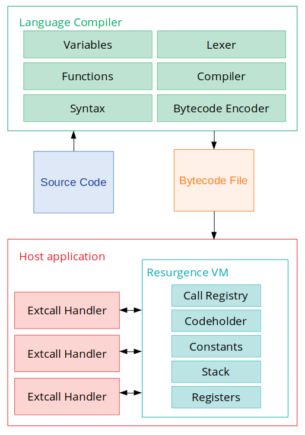

# Resurgence

Join the Discord server!

Resurgence aims to be an embeddable virtual machine with an easy-to-use API for projects like:
* Game engines
* Interpreters for programming languages
* Applications that want custom scripting behavior
* Applications that want to execute custom user code securely

Right now, Resurgence is currently in early stages of development, and shouldn't be used in any serious projects yet.

Note: Resurgence is just a virtual machine. This allows us to focus on making it good without having to worry about maintaining a language interpreter or library interface. For making a fully featured interpreter, we recommend [Crafting Interpreters](https://craftinginterpreters.com/) to get an idea on how to make one.

## Features
* Resurgence is a Register-based VM, which closely replicates the design of a real computer
* Resurgence is designed to be very lightweight and simple
* Resurgence is designed specifically for embedding into another application
* Code running inside Resurgence is sandboxed by default

## Architecture

## Security
Code running inside of a Resurgence VM is secure and sandboxed by default. The embedding application must explicitly register functions for any instructions to call external code. This essentially sandboxes code running inside of a VM to have a limited ability to access system features. Resurgence is also written using mostly safe Rust code, which makes it extremely difficult to escape this sandbox. This design makes Resurgence suitable for executing untrusted user code without compromising security.

Resurgence also doesn't provide a standard library of functions to use in programs, so by default Resurgence can't even modify stuff like files without a function defined to do so.

However, Resurgence's security ends at the programmer. It is the programmer's responsibility to maintain security on their end. That means making sure Rust API functions are also secure, bytecode isn't foing anything suspicious, etc.

Note: Dynamic loading is not supported by Resurgence. However, it could be implemented by the embedding application.

## Building Docs
To get basic documentation, run:

`cargo doc --open` 

If you want documentation for internal implementation stuff (yes, we document the internals), run:

`cargo doc --open --document-private-items`

